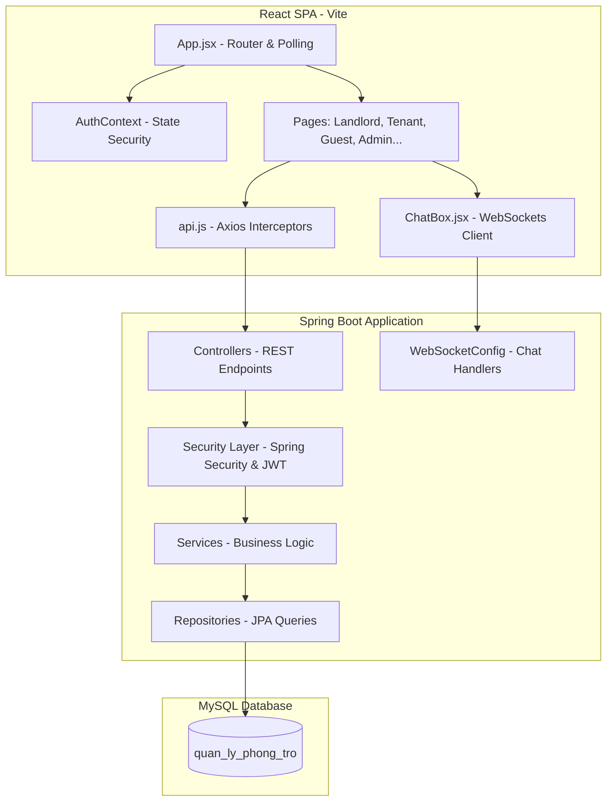

# Tổng Quan Kiến Trúc Mã Nguồn và Logic Hoạt Động Hệ Thống

Tài liệu này cung cấp cái nhìn chi tiết và toàn diện về toàn bộ dự án quản lý phòng trọ, phân tích chi tiết tác dụng, nội dung quan trọng và logic hoạt động của từng file từ **Backend (Spring Boot)** đến **Frontend (React / Vite)**.

---

## I. Tổng Quan Kiến Trúc Hệ Thống

Hệ thống được thiết kế theo mô hình **Client-Server** chuẩn với cấu trúc 3 lớp (3-tier architecture):
1. **Presentation Layer (Frontend)**: React Single Page Application (SPA) xây dựng bằng Vite, sử dụng CSS thuần (Vanilla CSS) để tùy biến giao diện cao cấp, kết hợp Axios để giao tiếp API và WebSockets để chat thời gian thực.
2. **Business & Data Access Layer (Backend)**: Spring Boot RESTful API kết hợp với Spring Security & JWT cho bảo mật, Hibernate/Spring Data JPA tương tác cơ sở dữ liệu.
3. **Database Layer**: MySQL quản lý toàn bộ dữ liệu quan hệ (Người dùng, Phòng trọ, Hợp đồng, Hóa đơn, Chỉ số điện nước, Khiếu nại, Tin nhắn).

---

## II. Chi Tiết Các File Backend (`backend`)

Thư mục backend chứa mã nguồn Java tổ chức theo các package tiêu chuẩn nhằm đảm bảo tính cô đọng, dễ mở rộng và bảo mật.

### 1. File Cấu Hình & Khởi Chạy Hệ Thống

#### 📌 **ServerApplication.java**
- **Tác dụng**: Điểm khởi chạy (Entry Point) của toàn bộ ứng dụng Spring Boot.
- **Logic & Nội dung tiêu biểu**: Sử dụng annotation `@SpringBootApplication` để tự động quét cấu hình và quét các Spring Beans trong dự án. Chứa phương thức `main` tiêu chuẩn gọi `SpringApplication.run(...)`.

#### 📌 **application.properties**
- **Tác dụng**: Cấu hình toàn bộ môi trường hệ thống (Cơ sở dữ liệu, Cổng chạy, Khóa bí mật, OAuth2).
- **Nội dung quan trọng**:
  - Cấu hình kết nối MySQL: sử dụng user `1532006quang` kết nối đến database `quan_ly_phong_tro` với chế độ `spring.jpa.hibernate.ddl-auto=update` để tự động đồng bộ thực thể Java sang bảng SQL.
  - Cấu hình cổng chạy Server: chạy trên port `8080` ở mọi IP (`0.0.0.0`).
  - Định nghĩa mã bí mật JWT (`jwt.secret`) siêu bảo mật và thời gian hết hạn (24 giờ).
  - Cài đặt Client ID và Client Secret cho đăng nhập mạng xã hội Google & Facebook.

---

### 2. Package Thực Thể JPA (`com.btl.server.entity`)

Định nghĩa cấu trúc dữ liệu lưu trữ trực tiếp dưới MySQL và các mối quan hệ (OnetoOne, OnetoMany, ManytoOne).

| Tên File Entity | Tác Dụng / Bảng Dữ Liệu Tương Ứng | Các Trường & Logic Quan Trọng |
| :--- | :--- | :--- |
| **TaiKhoan.java** | Bảng `tai_khoan`: Quản lý tài khoản đăng nhập hệ thống. | `username` (duy nhất, khóa phụ đăng nhập), `password` (đã mã hóa bcrypt), `role` (`ADMIN`, `LANDLORD`, `TENANT`), `locked` (cho phép admin khóa tài khoản), liên kết `@OneToOne` với `KhachHang`. |
| **KhachHang.java** | Bảng `khach_hang`: Lưu trữ thông tin cá nhân của người dùng. | Lưu họ tên, số điện thoại, email, số CCCD, thông tin ngân hàng (số tài khoản, tên ngân hàng, chủ tài khoản) phục vụ thanh toán tiền phòng. Mối quan hệ `@OneToOne` hai chiều với `TaiKhoan`. |
| **PhongTro.java** | Bảng `phong_tro`: Lưu thông tin các phòng trọ trong hệ thống. | `tenPhong`, `giaPhong`, `trangThai` (`TRONG`, `DA_THUE`, `BAO_TRI`), `dienTich`, `diaChi`, `hinhAnh` (chuỗi Base64 cực dài chứa dữ liệu ảnh phòng), `moTa`, và liên kết `@ManyToOne` đến `TaiKhoan` (chủ trọ). |
| **HopDong.java** | Bảng `hop_dong`: Hợp đồng thuê phòng giữa khách thuê và chủ trọ. | Lưu ngày bắt đầu, ngày kết thúc, tiền đặt cọc (`tienCoc`), trạng thái hợp đồng `trangThai` (`CHO_DUYET`, `DA_DUYET`, `YEU_CAU_HUY`, `DA_KET_THUC`, `TU_CHOI`), liên kết `@ManyToOne` với `KhachHang` và `PhongTro`. |
| **ChiSoDienNuoc.java** | Bảng `chi_so_dien_nuoc`: Ghi nhận lượng tiêu thụ điện nước định kỳ. | Lưu `thang`, `nam`, `soDienCu`, `soDienMoi`, `soNuocCu`, `soNuocMoi`, liên kết `@ManyToOne` với `PhongTro`. |
| **HoaDon.java** | Bảng `hoa_don`: Quản lý hóa đơn thu tiền phòng hàng tháng. | Lưu tổng tiền phòng, tiền điện, tiền nước, tổng cộng tiền (`tongTien`), `trangThai` (`CHUA_THANH_TOAN`, `DA_THANH_TOAN`). Tự động phát sinh sau khi chốt số điện nước. |
| **KhieuNai.java** | Bảng `khieu_nai`: Ghi nhận phản ánh từ khách thuê. | Chứa tiêu đề, nội dung khiếu nại, ngày gửi, trạng thái xử lý (`CHO_XU_LY`, `DA_XU_LY`), liên kết đến `PhongTro`. |
| **TinNhan.java** | Bảng `tin_nhan`: Lưu trữ nội dung chat. | Lưu `nguoiGuiId`, `nguoiNhanId`, `noiDung`, `thoiGianGui` phục vụ tính năng chat thời gian thực. |
| **NhatKyHoatDong.java** | Bảng `nhat_ky_hoat_dong`: Ghi vết lịch sử hệ thống. | Ghi lại hành động của Admin/Chủ trọ, mô tả chi tiết, địa chỉ IP và mốc thời gian. |
| **ThongBao.java** | Bảng `thong_bao`: Thông báo chung của hệ thống hoặc khu trọ. | Tiêu đề, nội dung, ngày tạo, liên kết tới người nhận hoặc thông báo chung. |

---

### 3. Các Lớp Enums Trạng Thái (`com.btl.server.enums`)
Định nghĩa tập hợp các giá trị hằng số cố định cho các trạng thái trong hệ thống.

*   📌 **AuthProvider.java**: Chứa hình thức đăng nhập (`LOCAL` - tài khoản mật khẩu thường, `GOOGLE`, `FACEBOOK`).
*   📌 **Role.java**: Định nghĩa vai trò hệ thống (`ROLE_USER`, `ROLE_ADMIN`, `ROLE_LANDLORD`).
*   📌 **TrangThaiPhong.java**: Trạng thái phòng (`TRONG`, `DA_THUE`, `BAO_TRI`).
*   📌 **TrangThaiHopDong.java**: Trạng thái hợp đồng (`CHO_DUYET` - chờ phê duyệt, `DA_DUYET` - có hiệu lực, `YEU_CAU_HUY` - khách xin hủy, `DA_KET_THUC` - đã hết hạn, `TU_CHOI` - bị từ chối).
*   📌 **TrangThaiHoaDon.java**: Trạng thái đóng tiền (`CHUA_THANH_TOAN`, `DA_THANH_TOAN`).

---

### 4. Đối Tượng Chuyển Đổi Dữ Liệu DTO (`com.btl.server.dto`)
Chứa các lớp Java thuần dùng để nhận dữ liệu từ Client gửi lên hoặc đóng gói dữ liệu trả về cho Frontend, giúp che giấu cấu trúc thực thể DB gốc và tăng tốc độ truyền tải.

*   📌 **AuthRequestDTO.java**: Nhận dữ liệu Đăng nhập/Đăng ký gồm `username`, `password`, và `role`.
*   📌 **CapNhatHoSoDTO.java**: Nhận thông tin chỉnh sửa hồ sơ (SĐT, Email, CCCD, thông tin ngân hàng).
*   📌 **HoSoResponseDTO.java**: Đóng gói dữ liệu hồ sơ cá nhân trả về cho Client hiển thị.
*   📌 **HopDongRequestDTO.java**: Nhận yêu cầu đặt thuê phòng gồm `phongTroId`, `ngayBatDau`, `ngayKetThuc`, và `tienCoc`.
*   📌 **KhachHangDTO.java**: DTO chứa thông tin thu gọn của khách thuê.
*   📌 **PhieuTinhTienDTO.java**: Trả về kết quả tính tiền chi tiết sau khi chốt số điện nước (giá phòng, số điện nước tiêu thụ, tiền điện nước lẻ và tổng số tiền cuối cùng).
*   📌 **ThongKeDTO.java**: Trả về số liệu thống kê tài chính và số lượng phòng phục vụ vẽ biểu đồ trang Dashboard.

---

### 5. Tầng Xử Lý Ngoại Lệ Trung Tâm (`com.btl.server.exception`)
Xử lý lỗi tập trung để đảm bảo hệ thống luôn trả về thông báo JSON đẹp mắt thay vì hiển thị lỗi HTML trắng trơn của máy chủ.

*   📌 **BadRequestException.java**: Lỗi dữ liệu yêu cầu sai định dạng hoặc không hợp lý (400).
*   📌 **ForbiddenException.java**: Lỗi truy cập trái phép, không đúng quyền sở hữu (403).
*   📌 **NotFoundException.java**: Lỗi không tìm thấy dữ liệu (404).
*   📌 **GlobalExceptionHandler.java**:
    *   **Tác dụng**: Đánh chặn toàn bộ lỗi ném ra từ bất kỳ đâu trong ứng dụng.
    *   **Logic hoạt động**: Sử dụng `@RestControllerAdvice` để bắt lỗi và đóng gói thành JSON trả về cho Client.
        *   Bắt lỗi `@Valid` (`MethodArgumentNotValidException`): trả về Map chi tiết các trường bị thiếu/sai.
        *   Bắt lỗi trùng lặp khoá ngoại SQL (`DataIntegrityViolationException`): tự động chuyển đổi thành thông điệp tiếng Việt thân thiện "Dữ liệu không hợp lệ hoặc đã tồn tại trong hệ thống (CCCD/SĐT/Email)." để tránh lộ lỗi cơ sở dữ liệu gốc.
        *   Bắt các lỗi tự định nghĩa (`NotFoundException`, `BadRequestException`, `ForbiddenException`) để gán mã HTTP Status tương ứng.

---

### 6. Tầng Bảo Mật Spring Security & JWT (`com.btl.server.security`)

#### 📌 **SecurityConfig.java**
- **Tác dụng**: Trọng tâm cấu hình bảo mật phân quyền toàn hệ thống.
- **Logic hoạt động**:
  - Cấu hình CORS dựa trên thuộc tính `cors.allowed.origins` trong file cấu hình.
  - Vô hiệu hóa CSRF và cấu hình cơ chế phiên là `STATELESS` (không lưu trạng thái phía máy chủ, hoàn toàn dựa vào JWT).
  - Phân quyền endpoint chi tiết:
    - Cho phép công khai (`permitAll()`): Các API đăng nhập/đăng ký (`/api/tai-khoan/**`), đăng nhập mạng xã hội OAuth2, WebSocket endpoint (`/ws/**`), xem danh sách phòng trọ trống (`GET /api/phong-tro/**`).
    - Phân quyền theo vai trò (`hasAnyRole("ADMIN", "LANDLORD")`): Các hành động thêm, sửa, xóa phòng trọ.
    - Bảo vệ các API còn lại: Yêu cầu phải đăng nhập thành công (`authenticated()`).
  - Đăng ký bộ lọc `JwtAuthenticationFilter` chạy trước bộ lọc đăng nhập mặc định của Spring.
  - Tích hợp đăng nhập mạng xã hội OAuth2 với dịch vụ xử lý thông tin người dùng và xử lý thành công.
- **Các biến/hàm chính**:
  - `allowedOrigins` (String): Lấy danh sách domain được phép truy cập CORS từ file cấu hình.
  - `userDetailsService()` (Method): Định nghĩa cách truy tìm tài khoản người dùng từ cơ sở dữ liệu dựa trên Username đăng nhập.
  - `securityFilterChain(...)` (Method): Định nghĩa toàn bộ chuỗi lọc an ninh mạng Spring Security.

#### 📌 **JwtService.java**
- **Tác dụng**: Tạo lập, giải mã và xác thực mã Token JWT.
- **Logic hoạt động**: Sử dụng thuật toán mã hóa HMAC256 kết hợp mã khoá bí mật `jwt.secret` để ký số tạo token. Cung cấp các hàm giải mã ngược token để trích xuất quyền và kiểm tra hạn sử dụng.
- **Các biến/hàm chính**:
  - `secret` (String): Khoá bí mật dùng để ký token.
  - `jwtExpiration` (Long): Thời gian sống của Token (được tính bằng mili giây).
  - `generateToken(username, role)`: Hàm đóng gói tên tài khoản và vai trò của họ vào Claims, ký mã và xuất ra chuỗi Token dạng Base64 gửi về cho Client.
  - `extractUsername(token)` / `extractRole(token)`: Hàm giải mã chuỗi JWT để lấy thông tin tài khoản và vai trò của họ.

#### 📌 **JwtAuthenticationFilter.java**
- **Tác dụng**: Bộ lọc đánh chặn (Interceptor Filter) kiểm tra Token cho mỗi Request gửi lên.
- **Logic hoạt động**: Chạy trước khi request chạm vào các Controller. Đọc tiêu đề HTTP `Authorization`. Nếu có token hợp lệ, nó sẽ giải mã lấy Username, nạp thông tin đăng nhập vào `SecurityContextHolder` của hệ thống để xác nhận người dùng này đã đăng nhập hợp pháp.
- **Các hàm chính**:
  - `doFilterInternal(...)`: Hàm thực thi lọc. Kiểm tra tiền tố `Bearer `, gọi `JwtService` kiểm định, nạp đối tượng đăng nhập vào ngữ cảnh Spring Security.

#### 📌 **PhongTroSecurityService.java**
- **Tác dụng**: Lớp kiểm tra quyền hạn sở hữu phòng trọ nâng cao.
- **Logic hoạt động**: Ngăn chặn tình trạng chủ trọ A cố tình sửa hoặc chốt số điện nước của phòng trọ thuộc sở hữu của chủ trọ B thông qua việc can thiệp thay đổi ID trên URL request.
- **Các hàm chính**:
  - `isOwner(phongId, chuTroId)`: Kiểm tra xem phòng có ID `phongId` có thực sự thuộc sở hữu của tài khoản `chuTroId` hay không. Trả về `true` / `false` làm căn cứ để Spring Security chặn quyền ở tầng Service.

#### 📌 **CustomOAuth2UserService.java**
- **Tác dụng**: Tiếp nhận thông tin người dùng gửi về từ nhà cung cấp OAuth2 (Google hoặc Facebook) khi họ click đăng nhập mạng xã hội ở Frontend.
- **Logic hoạt động**: Kế thừa `DefaultOAuth2UserService`. Trích xuất Email cá nhân từ Google/Facebook. Kiểm tra xem Email này đã tồn tại trong bảng `tai_khoan` chưa:
  - *Chưa*: Tự động gọi hàm tạo tài khoản mới với vai trò mặc định là khách thuê nhà (`TENANT`), tự động tạo hồ sơ khách hàng liên kết tương ứng.
  - *Rồi*: Kiểm tra xem nhà cung cấp đăng nhập (`provider`) có khớp không (Ví dụ nếu đăng ký bằng Google thì không được dùng nút Facebook để chèn đè tài khoản). Cập nhật lại họ tên mới nếu có thay đổi.
- **Các hàm chính**:
  - `loadUser(userRequest)`: Gọi API nhà mạng xã hội lấy thông tin thô.
  - `processOAuth2User(...)`: Thực thi logic kiểm tra và tự động lưu tài khoản vào cơ sở dữ liệu.

#### 📌 **OAuth2AuthenticationSuccessHandler.java**
- **Tác dụng**: Hoàn thành luồng đăng nhập mạng xã hội và chuyển hướng người dùng về giao diện React.
- **Logic hoạt động**: Kế thừa `SimpleUrlAuthenticationSuccessHandler`. Sau khi `CustomOAuth2UserService` hoàn thành việc lưu người dùng dưới DB, Handler này sẽ tạo một Token JWT hệ thống tương ứng với tài khoản đó, đính Token vào URL redirect của React (ví dụ: `http://localhost:5173/oauth2/redirect?token=...`) và thực hiện lệnh chuyển hướng trình duyệt của người dùng về giao diện.
- **Các biến chính**:
  - `redirectUri` (String): Đường dẫn callback nhận diện token phía Frontend (đọc từ thuộc tính `oauth2.redirect.uri` trong config).

---

### 7. Tầng Truy Cập Dữ Liệu JPA Repository (`com.btl.server.repository`)
Các Interface cung cấp các phương thức truy vấn nhanh SQL xuống cơ sở dữ liệu thông qua cơ chế Spring Data JPA.

- 📌 **TaiKhoanRepository.java**: Chứa hàm tìm kiếm tài khoản theo username `findByUsername(String username)`. Có `ChuTroProjection` dùng để truy vấn tối ưu chỉ lấy ID và tên hiển thị của các chủ trọ phục vụ chức năng chọn chủ trọ khi đăng ký hoặc gán phòng.
- 📌 **PhongTroRepository.java**: Chứa hàm lấy danh sách phòng theo chủ trọ, theo trạng thái. Đặc biệt chứa `@Query` JPQL `searchPhongTro(...)` thực hiện tìm kiếm động đa tiêu chí (tên phòng, địa chỉ gần đúng, khoảng giá thuê tối thiểu-tối đa và trạng thái phòng).
- 📌 **HopDongRepository.java**: Chứa hàm tìm kiếm hợp đồng theo khách thuê, chủ trọ.
  - **Logic nâng cao**: Chứa `@Modifying` và câu lệnh UPDATE `@Query` `tuChoiCacHopDongChoDuyetKhac(...)` để tự động cập nhật hàng loạt trạng thái của các đơn đăng ký thuê phòng khác sang **TỪ CHỐI** ngay khi một hợp đồng của phòng đó được chủ trọ duyệt thành công.
- 📌 **HoaDonRepository.java**: Quản lý hoá đơn, kiểm tra sự tồn tại hoá đơn của phòng trọ theo kỳ tháng/năm.
- 📌 **ChiSoDienNuocRepository.java**: Tìm kiếm chỉ số công tơ điện nước của một phòng theo kỳ tháng/năm.
- 📌 **KhachHangRepository.java**: Interface thao tác bảng dữ liệu hồ sơ cá nhân.
- 📌 **KhieuNaiRepository.java**: Thao tác bảng dữ liệu khiếu nại.
- 📌 **NhatKyRepository.java**: Thao tác lưu vết nhật ký lịch sử.
- 📌 **ThongBaoRepository.java**: Truy xuất bảng tin tức thông báo.
- 📌 **TinNhanRepository.java**: Truy xuất lịch sử chat của 2 người dùng sắp xếp tăng dần theo thời gian gửi tin nhắn.

---

### 8. Tầng Nghiệp Vụ - Business Service Layer (`com.btl.server.service`)
Nơi chứa toàn bộ tư duy và các quy tắc kiểm soát nghiệp vụ (Business Rules) của dự án.

#### 📌 **HopDongService.java**
- **Tác dụng**: Quản lý vòng đời hợp đồng thuê phòng (Tạo mới, Duyệt hợp đồng, Gia hạn, Yêu cầu huỷ).
- **Logic hoạt động**:
  - *Tạo hợp đồng*: Nhận DTO yêu cầu, kiểm tra ngày kết thúc phải sau ngày bắt đầu, kiểm tra phòng có tồn tại không. Đảm bảo trạng thái phòng phải là **TRỐNG** và không có hợp đồng nào khác đã duyệt trên phòng này. Ngăn khách thuê gửi trùng yêu cầu chờ duyệt. Nếu hợp lệ, lưu hợp đồng với trạng thái `CHO_DUYET`.
  - *Duyệt hợp đồng*: Khi trạng thái chuyển sang `DA_DUYET`, tự động cập nhật trạng thái phòng trọ sang `DA_THUE`. Kích hoạt bulk update từ chối tự động toàn bộ các hợp đồng chờ duyệt khác của phòng này dưới database.
  - *Thanh lý hợp đồng*: Khi trạng thái chuyển về `DA_KET_THUC`, `DA_THANH_LY`, `TU_CHOI` hoặc `HUY`, hệ thống kiểm tra xem phòng này có còn hợp đồng thuê nào khác đang hoạt động không. Nếu hoàn toàn trống khách, tự động đưa trạng thái phòng về lại **TRỐNG**.
  - *Hủy hợp đồng từ khách thuê*: Khi khách thuê nhấn hủy hợp đồng đang thuê, trạng thái chuyển sang `YEU_CAU_HUY` nhưng phòng vẫn giữ nguyên trạng thái `DA_THUE` (giữ chỗ cọc) cho đến khi chủ trọ phê duyệt chính thức trên dashboard.
- **Các hàm chính**:
  - `taoHopDong(request, khachHang)`: Khách thuê tạo yêu cầu thuê phòng.
  - `capNhatTrangThaiHopDong(id, trangThaiMoi, ngayKetThuc, currentUser)`: Chủ trọ hoặc Admin thay đổi trạng thái hợp đồng thuê.
  - `giaHanHopDong(id, ngayKetThucMoi, currentUser)`: Chủ trọ gia hạn thêm thời gian thuê.
  - `huyHopDongBoiKhach(id, currentUser)`: Khách thuê gửi yêu cầu xin chấm dứt hợp đồng.

#### 📌 **PhongTroService.java**
- **Tác dụng**: Xử lý logic nghiệp vụ quản lý danh mục phòng trọ.
- **Logic hoạt động**:
  - *Xóa phòng*: Kiểm tra xem phòng có đang ở trạng thái **ĐÃ THUÊ** hay không. Nếu đang có khách thuê, ném ngay ra lỗi `BadRequestException` để ngăn chặn hành động xóa phòng trái phép làm ảnh hưởng khách thuê nhà. Nếu phòng trống, thực hiện xóa cascade: trước tiên xóa sạch các thực thể phụ thuộc trỏ khoá ngoại tới phòng trọ này ở các bảng chỉ số điện nước, bảng hóa đơn và bảng hợp đồng cũ để tránh lỗi toàn vẹn khóa ngoại MySQL, sau đó mới tiến hành xóa phòng trọ khỏi cơ sở dữ liệu.
- **Các hàm chính**:
  - `searchPhongTro(...)`: Tìm kiếm phòng trọ đa tiêu chí.
  - `capNhatTrangThaiPhong(id, trangThaiMoi)`: Thay đổi trạng thái phòng. Nếu chuyển sang **TRỐNG**, tự động thanh lý chấm dứt các hợp đồng cũ liên quan của phòng này.
  - `deletePhong(id)`: Thực hiện xóa phòng trọ kèm logic cascade an toàn dữ liệu.

#### 📌 **ChiSoDienNuocService.java**
- **Tác dụng**: Nghiệp vụ quản lý chỉ số điện nước và tự động lập hóa đơn.
- **Logic hoạt động**:
  - *Chốt số & Tính tiền*: Đảm bảo số mới lớn hơn hoặc bằng số cũ. Đảm bảo kỳ tháng/năm này phòng chưa chốt số để tránh tính tiền lặp. Tính toán lượng tiêu thụ, nhân với các hằng số đơn giá dịch vụ: **Đơn giá Điện: 3500đ/kWh**, **Đơn giá Nước: 20000đ/khối**.
  - Cộng thêm giá thuê phòng mặc định của phòng trọ để ra tổng tiền cuối cùng.
  - Tự động lưu một thực thể hóa đơn mới (`HoaDon`) với trạng thái mặc định ban đầu là `CHUA_THANH_TOAN` và lưu chỉ số điện nước mới chốt vào cơ sở dữ liệu.
- **Các biến & hàm chính**:
  - `GIA_DIEN` (BigDecimal): Hằng số giá điện cố định (3500.0).
  - `GIA_NUOC` (BigDecimal): Hằng số giá nước cố định (20000.0).
  - `chotSoVaTinhTien(chiSo)`: Thực hiện tính toán chỉ số tiêu thụ và tự động lập hóa đơn mới.
  - `capNhatChiSoVaTinhTien(hoaDonId, chiSoMoi)`: Thay đổi chỉ số tiêu dùng của một hóa đơn chưa thanh toán và tính toán lại tổng tiền tương ứng.

#### 📌 **HoaDonService.java**
- **Tác dụng**: Nghiệp vụ quản lý hóa đơn tiền phòng.
- **Logic hoạt động**: Cho phép lấy lịch sử hóa đơn, xóa hóa đơn chưa thanh toán hoặc cập nhật trạng thái đóng tiền sang **ĐÃ THANH TOÁN** khi khách đã chuyển khoản thành công.
- **Các hàm chính**:
  - `capNhatTrangThaiThanhToan(id, trangThai)`: Đánh dấu hóa đơn đã đóng tiền hay chưa đóng.

#### 📌 **KhachHangService.java**
- **Tác dụng**: Cập nhật thông tin cá nhân và tài khoản ngân hàng.
- **Logic hoạt động**: Nhận DTO cập nhật hồ sơ, lấy tài khoản hiện tại từ database, cập nhật các trường thông tin cá nhân và thông tin tài khoản ngân hàng thụ hưởng tiền phòng.

#### 📌 **ThongKeService.java**
- **Tác dụng**: Tổng hợp dữ liệu phân tích kinh doanh cho chủ trọ.
- **Logic hoạt động**:
  - Truy xuất tất cả hóa đơn `DA_THANH_TOAN` để tính toán tổng doanh thu.
  - Đếm số lượng phòng theo trạng thái trống, đã thuê, bảo trì.
  - Đếm số hợp đồng thuê phòng đang chờ duyệt.
  - Tổng hợp doanh thu chi tiết theo từng tháng trong năm hiện tại để vẽ đồ thị cột.
- **Các hàm chính**:
  - `layDuLieuThongKe(chuTroId)`: Đóng gói toàn bộ số liệu thống kê vào `ThongKeDTO`.

#### 📌 **NhatKyService.java**
- **Tác dụng**: Ghi vết nhật ký hoạt động hệ thống.
- **Logic hoạt động**: Nhận thông tin mô tả hành động, trích xuất IP từ HTTP request và lưu trực tiếp bản ghi vào bảng nhật ký hoạt động dưới cơ sở dữ liệu.

---

### 9. Lớp Nhận Yêu Cầu REST API Controller (`com.btl.server.controller`)
Tiếp tiếp nhận yêu cầu gửi lên từ Frontend React thông qua giao thức HTTP REST, gọi lớp Service xử lý nghiệp vụ tương ứng và trả phản hồi JSON.

| Tên File Controller | Các Cổng Endpoint Chính & Logic Hoạt Động |
| :--- | :--- |
| **TaiKhoanController.java** | *   `POST /login`: Thực hiện chứng thực tài khoản. Để chống tấn công Timing Attack dò kênh thời gian, nếu không tìm thấy username, hệ thống vẫn thực thi thuật toán băm khớp mật khẩu giả `BCRYPT_DUMMY_HASH`. Kiểm tra xem tài khoản có bị khóa không (`locked = true` thì chặn ngay trả về 403). Tạo JWT và trả về Client nếu thành công. *   `POST /register`: Tiếp nhận đăng ký tài khoản mới. Ràng buộc kiểm tra tài khoản duy nhất dưới DB. *   `GET /me`: Trả về thông tin ID và Username của tài khoản đang đăng nhập. *   `GET /admin/danh-sach-tai-khoan`: Lấy danh sách tài khoản phân trang dành riêng cho quyền ADMIN. *   `PUT /admin/{id}/toggle-lock`: Thực hiện khoá hoặc mở khoá tài khoản. *   `DELETE /admin/{id}`: ADMIN thực hiện xoá tài khoản. Ràng buộc an toàn dữ liệu: không cho phép xoá tài khoản ADMIN khác, chủ trọ đang quản lý phòng hoạt động hoặc khách thuê đang có hợp đồng hiệu lực. |
| **PhongTroController.java** | *   `GET /api/phong-tro`: Trả về danh sách phòng trống công khai cho khách trọ tìm kiếm. *   `POST /api/phong-tro`: Thêm phòng trọ mới kèm chuỗi Base64 hình ảnh tải lên. *   `DELETE /api/phong-tro/{id}`: Yêu cầu xoá phòng trọ (gọi hàm xoá cascade an toàn dữ liệu). *   `GET /api/phong-tro/tim-kiem`: Tiếp nhận bộ lọc tìm kiếm động đa tiêu chí. |
| **HopDongController.java** | *   `POST /api/hop-dong`: Khách thuê tạo yêu cầu thuê phòng. *   `PUT /api/hop-dong/{id}/trang-thai`: Chủ trọ hoặc Admin thay đổi trạng thái hợp đồng (Duyệt, từ chối, huỷ hợp đồng). Ngăn chặn hành vi can thiệp hợp đồng khu trọ khác bằng cách đối chiếu quyền sở hữu phòng trọ. *   `PUT /api/hop-dong/{id}/gia-han`: Cho phép chủ trọ gia hạn hợp đồng. *   `POST /api/hop-dong/{id}/khach-huy`: Khách thuê gửi đơn yêu cầu huỷ hợp đồng trước thời hạn. |
| **ChiSoDienNuocController.java** | *   `POST /api/chi-so-dien-nuoc/chot-so`: Nhận dữ liệu chỉ số công tơ điện nước hàng tháng để tính tiền và tự lập hóa đơn. |
| **HoaDonController.java** | *   `GET /api/hoa-don/chu-tro/{id}`: Lấy danh sách hóa đơn khu trọ của chủ. *   `GET /api/hoa-don/khach/{id}`: Lấy lịch sử hóa đơn tiền phòng của riêng khách thuê. *   `PUT /api/hoa-don/{id}/thanh-toan`: Cập nhật trạng thái đã đóng tiền phòng. |
| **KhieuNaiController.java** | *   `POST /api/khieu-nai`: Khách thuê gửi khiếu nại báo sự cố phòng trọ. *   `PUT /api/khieu-nai/{id}/xu-ly`: Chủ trọ đánh dấu sự cố phản ánh đã được sửa chữa, xử lý xong. |
| **ChatController.java** | *   `GET /api/tin-nhan/lich-su`: Tải lại toàn bộ lịch sử tin nhắn chat giữa hai người dùng. |
| **ThongKeController.java** | *   `GET /api/thong-ke/chu-tro/{id}`: Cung cấp số liệu thống kê tài chính vẽ biểu đồ cột. |
| **ThongBaoController.java** | *   `GET /api/thong-bao`: Xem các bản tin thông báo chung trong hệ thống. |

---

### 10. File Cấu Hình WebSocket Kết Nối Chat (`com.btl.server.config`)

#### 📌 **WebSocketConfig.java**
- **Tác dụng**: Cấu hình máy chủ WebSocket hỗ trợ tính năng chat thời gian thực.
- **Logic hoạt động**: Đăng ký endpoint kết nối là `/ws` hỗ trợ SockJS để dự phòng khi trình duyệt cũ không hỗ trợ WebSocket thuần. Thiết lập bộ môi giới tin nhắn (`Message Broker`) định tuyến tin nhắn đến các kênh đăng ký trước (Prefix `/app` để gửi tin và `/topic` / `/queue` để nhận tin).
- **Các hàm chính**:
  - `registerStompEndpoints(...)`: Khai báo cổng kết nối `/ws` và cấu hình cho phép nhận kết nối chéo CORS từ mọi nguồn.
  - `configureMessageBroker(...)`: Cấu hình bộ định tuyến phân phát tin nhắn chat.

---

## PHẦN III: CHI TIẾT TOÀN BỘ CÁC FILE FRONTEND (`frontend`)

Phần giao diện người dùng được xây dựng hiện đại, tối ưu trải nghiệm và phân quyền hiển thị linh hoạt dựa trên dữ liệu vai trò nhận về từ Token.

### 1. File Điểm Đầu & Cấu Hình Mạng Toàn Cục

#### 📌 **main.jsx**
- **Tác dụng**: Điểm khởi tạo và vẽ giao diện React vào thẻ `div#root` trong file HTML.
- **Logic hoạt động**: Wrap toàn bộ thẻ `<App />` bên trong bộ định tuyến `<BrowserRouter>` của thư viện `react-router-dom` và cung cấp bộ dữ liệu xác thực `<AuthProvider>` bao bọc bên ngoài để quản lý trạng thái bảo mật toàn ứng dụng.
- **Ý nghĩa**: Khởi chạy cài đặt ngôn ngữ `i18n.js` và nạp file style gốc `index.css`.

#### 📌 **api.js**
- **Tác dụng**: Trung tâm cấu hình Axios Client giao tiếp mạng gửi yêu cầu lên Backend.
- **Logic hoạt động**: 
  - *Request Interceptor*: Tự động đọc mã Token lưu trong bộ nhớ trình duyệt `localStorage`. Nếu tồn tại token, nó sẽ tự động gán tiêu đề HTTP là `Authorization: Bearer <token>` cho mọi yêu cầu đi.
  - *Response Interceptor*: Đánh chặn phản hồi trả về. Nếu nhận mã lỗi `401 Unauthorized` từ máy chủ, nó kích hoạt sự kiện `'auth-error'` để yêu cầu React xoá phiên đăng nhập. Nếu nhận mã lỗi `403 Forbidden` do tài khoản đã bị khóa bởi quản trị viên, nó xoá token ngay lập tức, hiển thị thông báo cảnh báo popup đỏ và đẩy người dùng về màn hình đăng nhập.
- **Các biến chính**:
  - `api` (AxiosInstance): Đối tượng Axios đã cấu hình sẵn cổng kết nối lấy từ biến môi trường `VITE_API_URL` (mặc định là `http://localhost:8080/api`).

#### 📌 **i18n.js**
- **Tác dụng**: Cấu hình đa ngôn ngữ cho giao diện (Tiếng Việt / Tiếng Anh).
- **Logic hoạt động**: Sử dụng thư viện `react-i18next`. Đăng ký các file chứa bản dịch dạng JSON (`translation.json` trong thư mục `locales/vi` và `locales/en`). Tự động nhận diện và thiết lập ngôn ngữ hiển thị mặc định của trình duyệt người dùng.

---

### 2. Các File Styles CSS Thuần Cao Cấp (`frontend/src/*.css`)
Hệ thống sử dụng các file CSS thuần viết tay cực kỳ tỉ mỉ và chuyên nghiệp để thiết kế giao diện theo phong cách sang trọng, hiện đại:

*   📌 **index.css**: Khai báo hệ thống biến màu sắc toàn cục chuẩn CSS Variables (`--bg` - màu nền tối sang trọng, `--accent` - màu nhấn xanh công nghệ, `--surface` - nền card nổi, `--text-primary`, `--border`,...). Định nghĩa các lớp hiệu ứng hoạt hoạt mượt mà như xoay tròn loading (`spin`), hiệu ứng chuyển động trượt mờ dần (`fadeInUp`, `fadeIn`).
*   📌 **App.css**: Định hình khung bố cục bố trí toàn cục của ứng dụng React, thiết lập font chữ sang trọng và cách bài trí thanh Sidebar điều hướng.

---

### 3. File Điều Hướng Định Tuyến & Smart Polling Hợp Đồng

#### 📌 **App.jsx**
Là file điều phối hiển thị toàn bộ giao diện của dự án React:
- **Logic hoạt động**: 
  1. Chia tuyến đường truy cập bảo vệ: `PublicOnlyRoute` cho khách vãng lai đăng nhập, `ProtectedRoute` cho thành viên hệ thống truy cập `/dashboard`.
  2. Sau khi người dùng đăng nhập hợp lệ, Component `AppContent` được tải lên để nhận diện vai trò tài khoản:
    *   Nếu là **ADMIN**: Hiển thị bảng điều khiển quản trị `AdminPage`.
    *   Nếu là **CHỦ TRỌ**: Hiển thị bảng quản lý khu trọ `LandlordPage`.
    *   Nếu là **KHÁCH THUÊ** (ROLE_USER): Kích hoạt cơ chế **Smart Polling** chạy ngầm định kỳ **10 giây/lần** gọi API `/hop-dong/khach/{id}` để cập nhật liên tục trạng thái hợp đồng:
      *   *Không có hợp đồng*: Mở giao diện công khai tìm phòng `GuestPage`.
      *   *Có hợp đồng `CHO_DUYET`*: Khoá toàn bộ màn hình, chỉ hiển thị màn hình chờ duyệt `WaitingScreen` kèm nút kết nối Chat trực tiếp với chủ trọ của phòng đó để trao đổi phê duyệt hợp đồng.
      *   *Có hợp đồng `DA_DUYET`*: Mở khóa toàn bộ chức năng, hiển thị không gian làm việc chính thức `TenantPage`.
- **Các biến & hàm chính**:
  - `hopDongCuaToi` (State): Lưu trữ hợp đồng thuê hiện tại của khách đang đăng nhập.
  - `dangKiemTra` (State): Cờ hiển thị vòng xoay đang đồng bộ dữ liệu ngầm với máy chủ.
  - `chatTarget` (State): Lưu trữ ID và tên của người nhận tin chat đang được mở khung liên lạc.
  - `kiemTraHopDong(isBackground)` (Method): Gửi request lên API kiểm tra hợp đồng, cập nhật dữ liệu hiển thị.

---

### 4. Quản Lý Trạng Thái Xác Thực & Các Hooks Tiện Ích (`context` & `hooks`)

#### 📌 **AuthContext.jsx**
- **Tác dụng**: Cung cấp ngữ cảnh bảo mật và thông tin phiên đăng nhập cho toàn bộ ứng dụng React.
- **Logic hoạt động**: Lưu mã JWT token vào trình duyệt `localStorage` để giữ trạng thái đăng nhập khi tải lại trang. Gọi API `/tai-khoan/me` để lấy thông tin cá nhân.
- **Các biến & hàm chính**:
  - `user` (State): Lưu thông tin tài khoản đang đăng nhập (ID, Username, Role).
  - `isLoadingAuth` (State): Cờ hiệu đang kiểm tra xem phiên làm việc cũ còn hạn hay đã hết.
  - `loginSuccess(token, userData)`: Đăng ký Token mới vào bộ nhớ trình duyệt và cập nhật thông tin tài khoản người dùng vào State.
  - `logout()`: Xóa sạch mã token trong bộ nhớ và chuyển hướng người dùng về trang đăng nhập `/login`.

#### 📌 **useAuth.js**
- **Tác dụng**: Hook viết gọn giúp các Component khác lấy trực tiếp dữ liệu từ `AuthContext` mà không cần gọi lệnh `useContext(AuthContext)` dài dòng.

#### 📌 **useAdminContact.js**
- **Tác dụng**: Hook tự động lấy thông tin liên lạc của tài khoản ADMIN hệ thống.
- **Logic hoạt động**: Gửi yêu cầu lấy tài khoản ADMIN dưới DB để lấy ID phục vụ chức năng chat hỗ trợ kỹ thuật. Nếu API backend lỗi (ví dụ trong môi trường test chưa khởi tạo Admin dưới DB), hook sẽ tự động kích hoạt cơ chế **Fallback** gán mặc định Admin ID = 3 để đảm bảo hệ thống không bị lỗi giao diện.
- **Các biến**: `admin` (State chứa ID/Username Admin), `loading` (State chờ tải API).

#### 📌 **usePhongTro.js**
- **Tác dụng**: Hook đóng gói các thao tác lấy danh sách phòng, thêm phòng và xóa phòng trọ của chủ trọ.
- **Các biến & hàm**:
  - `phongTros` (State): Mảng chứa danh sách các phòng trọ.
  - `addPhongTro(phongTroMoi)`: Hàm gửi yêu cầu thêm phòng mới lên Backend.
  - `deletePhongTro(id, tenPhong)`: Hàm hiển thị hộp thoại xác nhận và thực hiện gửi yêu cầu xoá phòng trọ.

---

### 5. Giao Diện Đăng Nhập & Màn Hình Khách Trọ Công Khai

#### 📌 **Login.jsx** & **Login.css**
- **Tác dụng**: Form Đăng nhập và Đăng ký tài khoản hệ thống.
- **Logic hoạt động**: Hỗ trợ chuyển đổi linh hoạt giữa giao diện Đăng nhập và Đăng ký. Khi đăng ký, cung cấp menu lựa chọn vai trò là Khách thuê nhà (`USER`) hoặc Chủ trọ (`LANDLORD`). Chứa các trường ràng buộc kiểm tra mật khẩu trùng khớp.
- **Các biến**:
  - `isRegistering` (State): Cờ đánh dấu đang hiển thị Form đăng ký hay Form đăng nhập.
  - `role` (State): Lựa chọn vai trò đăng ký (`USER` / `LANDLORD`).
  - `error` (State): Chuỗi hiển thị thông báo lỗi chi tiết khi máy chủ phản hồi thất bại.

#### 📌 **HomePage.jsx** & **HomePage.css**
- **Tác dụng**: Trang chủ giới thiệu quảng bá (Landing Page) khi người dùng chưa đăng nhập.
- **Logic hoạt động**: Trình bày thông tin tiếp thị, giao diện cực kỳ bắt mắt với hiệu ứng trượt sang trọng và cung cấp các nút CTA (Call to Action) để dẫn hướng người dùng sang trang đăng ký/đăng nhập.

#### 📌 **GuestPage.jsx** & **GuestPage.css**
- **Tác dụng**: Giao diện tìm kiếm, chọn lọc và gửi yêu cầu đặt thuê phòng trọ.
- **Logic hoạt động**: 
  1. Hiển thị thanh bộ lọc tìm kiếm động. Gọi API `/phong-tro/tim-kiem` mỗi khi các giá trị lọc thay đổi để tải lại danh sách phòng trọ trống tương ứng.
  2. Click vào phòng để mở hộp thoại chi tiết phòng `RoomDetailModal`.
  3. Click "Đặt thuê phòng" để hiển thị `ContractModal` chọn ngày thuê và đóng tiền đặt cọc mong muốn.
  4. Gửi yêu cầu thuê lên Backend và đồng thời mở kết nối WebSocket chat trực tiếp với chủ trọ để trao đổi hợp đồng.
- **Các biến**:
  - `filterTen` (State), `filterDiaChi` (State): Biến lưu chuỗi tìm kiếm tên phòng và khu vực.
  - `filterGiaMin` (State), `filterGiaMax` (State): Khoảng giá thuê mong muốn tìm kiếm.
  - `phongs` (State): Danh sách các phòng trọ trống nhận về từ API.

---

### 6. Không Gian Làm Việc Của Chủ Trọ (`pages/Landlord`)

#### 📌 **LandlordPage.jsx** & **LandlordPage.css**
- **Tác dụng**: Khung bố cục trung tâm cho tài khoản Chủ trọ.
- **Logic hoạt động**: Định nghĩa thanh Sidebar chuyển đổi giữa các tab công việc khác nhau (`DASHBOARD`, `ROOMS`, `CONTRACTS`, `INVOICES`, `UTILITIES`, `TENANTS`, `NOTICES`). Tải dữ liệu phòng trọ, danh sách hợp đồng, danh sách hóa đơn từ các API về và phân phối dữ liệu xuống cho các Tab Component con.
- **Các biến**:
  - `activeTab` (State): Tab chức năng hiện đang được chọn hiển thị.
  - `phongTros` (State), `hopDongs` (State), `hoaDons` (State): Các mảng dữ liệu quản lý toàn bộ khu trọ.

#### 📌 **RoomTab.jsx**
- **Tác dụng**: Tab quản lý danh mục phòng trọ (thêm mới, hiển thị danh sách phòng, bấm xóa phòng).
- **Logic hoạt động**:
  - *Hiển thị phòng*: Vẽ lưới các thẻ phòng trọ sinh động kèm màu sắc nhận diện trạng thái phòng (`TRONG` - màu xanh lá, `DA_THUE` - màu đỏ, `BAO_TRI` - màu vàng).
  - *Nén ảnh Base64 thông minh*: Lắng nghe sự kiện chọn tệp tin ảnh từ máy tính (`handleImageChange`). Sử dụng thư viện JavaScript `Canvas` tạo thẻ vẽ ảo, co chiều rộng/cao tối đa về mức 800px, tiến hành xuất dữ liệu ảnh dạng JPEG nén chất lượng giảm còn 70% (`canvas.toDataURL('image/jpeg', 0.7)`) rồi mới lưu chuỗi Base64 này vào State `hinhAnh` gửi lên DB.
- **Các biến chính**:
  - `tenPhong`, `giaPhong`, `tienCoc`, `dienTich`, `diaChi`, `hinhAnh`, `moTa` (States): Các biến lưu giá trị nhập liệu trên form để tạo phòng trọ mới.
  - `onXoaPhong`, `onXemChiTiet` (Props): Các hàm điều khiển nhận từ `LandlordPage` truyền xuống.

#### 📌 **ContractTab.jsx**
- **Tác dụng**: Tab xử lý phê duyệt hợp đồng thuê phòng và xử lý yêu cầu chấm dứt hợp đồng.
- **Logic hoạt động**:
  - Liệt kê danh sách các hợp đồng có trạng thái `CHO_DUYET`. Chủ trọ bấm "Duyệt" sẽ gọi API chuyển trạng thái thành `DA_DUYET` (lúc này phòng trọ sẽ tự động được hệ thống chuyển sang Đã thuê và từ chối các đơn chờ khác).
  - Liệt kê danh sách các hợp đồng khách xin huỷ `YEU_CAU_HUY`. Chủ bấm "Duyệt Huỷ" để giải phóng phòng trống.
  - Nút gia hạn hợp đồng mở biểu mẫu chọn ngày kết thúc mới.
- **Các biến**: `updatingId` (State ID hợp đồng đang gửi yêu cầu phê duyệt).

#### 📌 **InvoiceTab.jsx**
- **Tác dụng**: Tab chốt số điện nước, in PDF hóa đơn thanh toán hàng tháng.
- **Logic hoạt động**: Hiển thị danh sách hóa đơn theo từng phòng trọ. Có nút chốt số điện nước mở hộp thoại `UtilityModal` để gửi chỉ số mới lên máy chủ tự tính toán lập hóa đơn. Tích hợp tính năng kết xuất in PDF hóa đơn trực quan để gửi cho khách thuê.
- **Các hàm chính**:
  - `handlePrintInvoice(hoaDon)`: Hàm mở giao diện in của trình duyệt để in trực tiếp hóa đơn dạng biên lai thanh toán.

#### 📌 **UtilityTab.jsx**
- **Tác dụng**: Xem lịch sử ghi số điện nước của toàn bộ các phòng trọ qua các tháng để theo dõi lượng tiêu thụ hao phí.

#### 📌 **TenantListTab.jsx**
- **Tác dụng**: Xem hồ sơ lý lịch chi tiết của tất cả các khách đang thuê nhà trong khu trọ (Tên, SĐT, Email, số CCCD).

#### 📌 **NoticeTab.jsx**
- **Tác dụng**: Đăng các bài viết thông báo chung hiển thị lên bảng tin của khách thuê nhà.

#### 📌 **RoomDetailModal.jsx**
- **Tác dụng**: Hộp thoại popup phóng to hiển thị đầy đủ thông tin phòng trọ, hình ảnh lớn và thông tin hợp đồng thuê hiện tại của phòng đó.

#### 📌 **UtilityModal.jsx**
- **Tác dụng**: Hộp thoại biểu mẫu chốt số công tơ điện nước.
- **Logic hoạt động**: Chủ trọ chọn phòng, nhập chỉ số điện cũ, điện mới, nước cũ, nước mới và gửi yêu cầu để Backend tính toán sinh hóa đơn.

---

### 7. Không Gian Làm Việc Của Khách Thuê Nhà (`pages/Tenant`)

#### 📌 **TenantPage.jsx** & **TenantPage.css**
- **Tác dụng**: Bảng điều khiển toàn bộ cuộc sống phòng trọ dành cho người thuê nhà đã duyệt hợp đồng.
- **Logic hoạt động**:
  - *Mục Hóa đơn*: Hiển thị hóa đơn tiền phòng tháng hiện tại. Nếu hóa đơn ở trạng thái **CHƯA THANH TOÁN**, hệ thống tự động hiển thị biểu mẫu Hướng dẫn thanh toán gồm: Tên ngân hàng thụ hưởng, Số tài khoản nhận tiền phòng, Tên chủ sở hữu tài khoản ngân hàng của chủ trọ và cú pháp nội dung chuyển khoản tiền phòng để khách chuyển tiền chuẩn xác.
  - *Mục Khiếu nại*: Hiển thị danh sách các phản ánh sự cố cũ và cung cấp biểu mẫu `KhieuNaiForm` gửi phản ánh mới lên chủ trọ.
  - *Mục Hợp đồng*: Xem thời hạn hợp đồng và nút gửi đơn chấm dứt hợp đồng trước hạn.
- **Các biến**:
  - `activeSection` (State): Mục tính năng người thuê đang click xem (`DASHBOARD`, `INVOICES`, `COMPLAINTS`, `NOTICES`).
  - `khieuNais` (State): Mảng danh sách phản ánh sự cố của phòng.

---

### 8. Không Gian Quản Trị Hệ Thống (`pages/Admin`)

#### 📌 **AdminPage.jsx** & **AdminPage.css**
- **Tác dụng**: Màn hình quản trị toàn cục dành riêng cho vai trò ADMIN hệ thống.
- **Logic hoạt động**:
  - *Quản lý tài khoản*: Gọi API lấy danh sách tài khoản phân trang, hỗ trợ nút bấm khoá/mở khoá tài khoản lập tức và nút xoá tài khoản an toàn hệ thống.
  - *Theo dõi hoạt động*: Hiển thị danh sách nhật ký hoạt động hệ thống ghi vết hành vi của các thành viên.
- **Các biến**:
  - `currentPage` (State), `totalPages` (State): Các thông số phục vụ phân trang danh sách tài khoản.
  - `logs` (State): Mảng dữ liệu chứa lịch sử kiểm toán log.

---

### 9. Các Component Tiện Ích Giao Tiếp Chung (`components`)

#### 📌 **ChatBox.jsx**
- **Tác dụng**: Khung chat nổi thời gian thực góc phải màn hình.
- **Logic hoạt động**: 
  1. Khi mở khung chat, thực hiện gửi yêu cầu lấy lịch sử tin nhắn chat cũ giữa 2 người qua API `/tin-nhan/lich-su`.
  2. Khởi tạo đối tượng SockJS trỏ đến đường dẫn `/ws` của Backend, thiết lập STOMP Client kết nối.
  3. Đăng ký nhận tin nhắn mới từ kênh cá nhân `/queue/messages`. Khi có tin nhắn đến, nạp tin nhắn mới vào mảng lịch sử chat và tự động cuộn giao diện xuống dưới cùng.
  4. Khi gửi tin nhắn, đóng gói tin nhắn dạng JSON và gửi lên kênh `/app/chat`.
- **Các biến chính**:
  - `stompClient` (Ref): Lưu trữ thực thể kết nối WebSocket STOMP.
  - `messages` (State): Mảng chứa lịch sử cuộc hội thoại chat.
  - `newMessage` (State): Chuỗi lưu tin nhắn đang gõ trong ô nhập liệu.

#### 📌 **Header.jsx** & **Header.css**
- **Tác dụng**: Thanh tiêu đề điều hướng trên cùng hiển thị ở tất cả màn hình.
- **Logic hoạt động**: Hiển thị họ tên người dùng, vai trò của họ. Tích hợp menu thả xổ để chuyển đổi ngôn ngữ (VI / EN) và nút đăng xuất tài khoản.

#### 📌 **ContractModal.jsx**
- **Tác dụng**: Hộp thoại soạn yêu cầu thuê phòng cho Khách vãng lai.
- **Logic hoạt động**: Khách thuê chọn ngày bắt đầu dọn vào ở, ngày kết thúc trả phòng. Hiển thị thông số tiền đặt cọc và tiền thuê phòng hàng tháng tương ứng trước khi bấm nút xác nhận gửi đơn.
- **Các biến**: `ngayBatDau` (State), `ngayKetThuc` (State).

#### 📌 **ConfirmModal.jsx**
- **Tác dụng**: Hộp thoại cảnh báo xác nhận xóa hoặc thay đổi nguy hiểm, tăng tính chuyên nghiệp cho UI.

#### 📌 **HoSoForm.jsx**
- **Tác dụng**: Biểu mẫu cập nhật hồ sơ cá nhân và tài khoản ngân hàng.

#### 📌 **KhieuNaiForm.jsx**
- **Tác dụng**: Biểu mẫu soạn khiếu nại báo sự cố phòng trọ của khách thuê.

#### 📌 **QuanLyNguoiDung.jsx**
- **Tác dụng**: Biểu mẫu cho phép ADMIN tạo mới tài khoản thủ công hoặc điều chỉnh phân quyền của thành viên.

---

## PHẦN IV: TÓM TẮT CÁC THAM SỐ CẤU HÌNH & BIẾN SỐ TOÀN DỰ ÁN

Để dễ dàng tra cứu, dưới đây là bảng quy chuẩn các biến số cấu hình môi trường toàn hệ thống:

### 1. Cấu Hình Môi Trường Backend (`application.properties`)
- `spring.datasource.url`: Chuỗi kết nối tới MySQL Database `quan_ly_phong_tro` chạy trên cổng mặc định 3306.
- `jwt.secret`: Khóa ký số JWT bảo mật.
- `jwt.expiration`: Thời gian sống Token (86400000ms = 24 giờ).
- `cors.allowed.origins`: Cho phép các tên miền máy khách React kết nối API chéo.
- `oauth2.redirect.uri`: URL chuyển hướng trình duyệt của khách hàng sau khi Google/Facebook trả kết quả đăng nhập thành công.

### 2. Cấu Hình Môi Trường Frontend (`.env`)
- `VITE_API_URL`: Địa chỉ máy chủ Backend REST API (mặc định là `http://localhost:8080/api`).
- `VITE_WS_URL`: Địa chỉ máy chủ WebSocket phục vụ Chat thời gian thực (mặc định là `http://localhost:8080/ws`).

---

## PHẦN V: KẾT LUẬN

Hệ thống quản lý phòng trọ được thiết kế **vô cùng đồng bộ và chặt chẽ**:
1.  **Backend** đóng vai trò là "Người gác cổng" nghiêm ngặt bảo vệ dữ liệu bằng phân quyền JWT ở bộ lọc HTTP, kiểm tra quyền sở hữu phòng chống giả mạo ở tầng bảo mật Service, thực thi các kiểm tra ràng buộc nghiệp vụ nghiệp vụ (ngăn xóa phòng đang có khách, ngăn trùng lịch thuê) và tối ưu hóa hiệu năng bằng các truy vấn cập nhật hàng loạt dưới database.
2.  **Frontend** đóng vai trò là "Người truyền tải" tinh tế, sử dụng Canvas nén ảnh trực tiếp tại Client để tăng tốc độ tải, thiết kế CSS Variable mượt mà hiện đại và chạy cơ chế Smart Polling thông minh tự động thăm dò để thay đổi giao diện linh hoạt theo tiến trình phê duyệt của hợp đồng mà không yêu cầu người dùng phải thực hiện tải lại trang thủ công.
